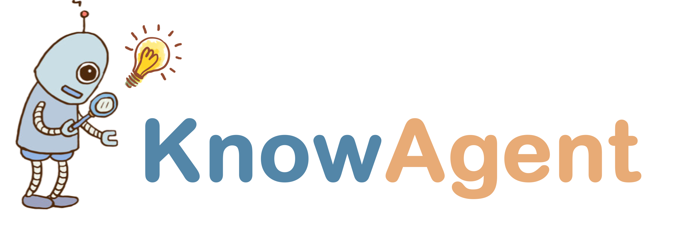

<div align="center">
  


  **Knowledge-Augmented Planning for LLM-Based Agents.**

  <p align="center">
  <a href="https://arxiv.org/abs/2403.03101">📄Paper</a> •
  <a href="https://www.zjukg.org/project/KnowAgent/">🌐Web</a>
	</p>  

[](https://github.com/zjunlp/KnowAgent) 
[](https://opensource.org/licenses/MIT)
 

</div>

---


​	Our development is grounded on several key steps: **Initially**, we create an extensive *action knowledge base*, which amalgamates action planning knowledge pertinent to specific tasks. This database acts as an external reservoir of information, steering the model's action generation process.  **Subsequently**, by converting action knowledge into text, we enable the model to deeply understand and utilize this knowledge in creating action trajectories. **Finally**, through a *knowledgeable self-learning* phase, we use trajectories developed from the model's iterative processes to continually improve its understanding and application of action knowledge. This process not only strengthens the agents' planning abilities but also enhances their potential for application in complex situations.


## 🌟Table of Contents

- [🌟Table of Contents](#table-of-contents)
- [🔧Installation](#installation)
- [:world_map:Planning Path Generation](#planning-path-generation)
- [📝Knowledgeable Self-Learning](#knowledgeable-self-learning)
- [🔖Citation](#citation)
- [✨Acknowledgement](#acknowledgement)


  

## 🔧Installation

To get started with KnowAgent, follow these simple installation steps:

```bash
git clone https://github.com/zjunlp/KnowAgent.git
cd KnowAgent
pip install -r requirements.txt
```

We have placed the HotpotQA and ALFWorld datasets under `Path_Generation/alfworld_run/data` and `Path_Generation/hotpotqa_run/data` respectively. For further configuration, we recommend proceeding with the original setup of [ALFWorld](https://github.com/alfworld/alfworld) and [FastChat](https://github.com/lm-sys/FastChat).

## :world_map:Planning Path Generation

The Planning Path Generation process is integral to KnowAgent. You can find the scripts for running the Planning Path Generation in `Path_Generation` directory, specifically `run_alfworld.sh` and `run_hotpotqa.sh`. These scripts can be executed using bash commands. To tailor the scripts to your needs, you may modify the `mode` parameter to switch between training (`train`) and testing (`test`)modes, and change the `llm_name` parameter to use a different LLM:

```
cd Path_Generation

# For training with HotpotQA
python run_hotpotqa.py --llm_name llama-2-13b --max_context_len 4000 --mode train --output_path ../Self-Learning/trajs/

# For testing with HotpotQA
python run_hotpotqa.py --llm_name llama-2-13b --max_context_len 4000 --mode test --output_path output/
    
# For training with ALFWorld
python alfworld_run/run_alfworld.py --llm_name llama-2-13b --mode train --output_path ../Self-Learning/trajs/

# For testing with ALFWorld
python alfworld_run/run_alfworld.py --llm_name llama-2-13b --mode test --output_path output/
```

## ♟️Knowledgeable Self-Learning

After obtaining the planning paths and corresponding trajectories, the process of Knowledgeable Self-Learning begins. The generated trajectories are first converted to the Alpaca format using the scripts in the `Self-Learning` directory, such as `traj_reformat.sh`. For initial iterations, use:

```
cd Self-Learning
# For HotpotQA
python train/Hotpotqa_reformat.py --input_path trajs/KnowAgentHotpotQA_llama-2-13b.jsonl --output_path train/datas

# For ALFWorld
python train/ALFWorld_reformat.py --input_path trajs/KnowAgentALFWorld_llama-2-13b.jsonl --output_path train/datas
```

For subsequent iterations, before running `traj_reformat.sh`, it's necessary to perform Knowledge-Based Trajectory Filtering and Merging using `traj_merge_and_filter.sh`:

```
python trajs/traj_merge_and_filter.py \
    --task HotpotQA \
    --input_path1  trajs/datas/KnowAgentHotpotQA_llama-2-13b_D0.jsonl \
    --input_path2  trajs/datas/KnowAgentHotpotQA_llama-2-13b_D1.jsonl \
    --output_path   trajs/datas 
```

Next, commence Self-Learning by running `train.sh` and `train_iter.sh`, referring to the scripts in `Self-Learning/train.sh` and `Self-Learning/train_iter.sh`:

```
CUDA_VISIBLE_DEVICES=0,1,2,3,4,5,6,7 deepspeed train/train_lora.py \
    --model_name_or_path  llama-2-13b-chat\
    --lora_r 8 \
    --lora_alpha 16 \
    --lora_dropout 0.05 \
    --data_path datas/data_knowagent.json \
    --output_dir models/Hotpotqa/M1 \
    --num_train_epochs 5 \
    --per_device_train_batch_size 2 \
    --per_device_eval_batch_size 1 \
    --gradient_accumulation_steps 1 \
    --evaluation_strategy "no" \
    --save_strategy "steps" \
    --save_steps 10000 \
    --save_total_limit 1 \
    --learning_rate 1e-4 \
    --weight_decay 0. \
    --warmup_ratio 0.03 \
    --lr_scheduler_type "cosine" \
    --logging_steps 1 \
    --fp16 True \
    --model_max_length 4096 \
    --gradient_checkpointing True \
    --q_lora False \
    --deepspeed /data/zyq/FastChat/playground/deepspeed_config_s3.json \
    --resume_from_checkpoint False 
```

## 🔖Citation

```bibtex

```

## ✨Acknowledgement

- We express our gratitude to the creators and contributors of the following projects, which have significantly influenced the development of KnowAgent:

  - **FastChat**: Our training module code is adapted from FastChat. [Visit FastChat](https://github.com/lm-sys/FastChat)，and Integration with open models through LangChain is facilitated via FastChat. [Learn more about LangChain and FastChat Integration](https://github.com/lm-sys/FastChat/blob/main/docs/langchain_integration.md).
  - **BOLAA**: The inference module code is implemented based on BOLAA. [Visit BOLAA](https://github.com/salesforce/BOLAA)
  - Additional baseline codes from **ReAct**, **Reflexion**, **FireAct**, and others have been utilized, showcasing a diverse range of approaches and methodologies.

  Our heartfelt thanks go out to all contributors for their invaluable contributions to the field!


## 🎉Contributors

<a href="https://github.com/zjunlp/knowagent/graphs/contributors">
  </a>

We will offer long-term maintenance to fix bugs and solve issues. So if you have any problems, please put issues to us.  

